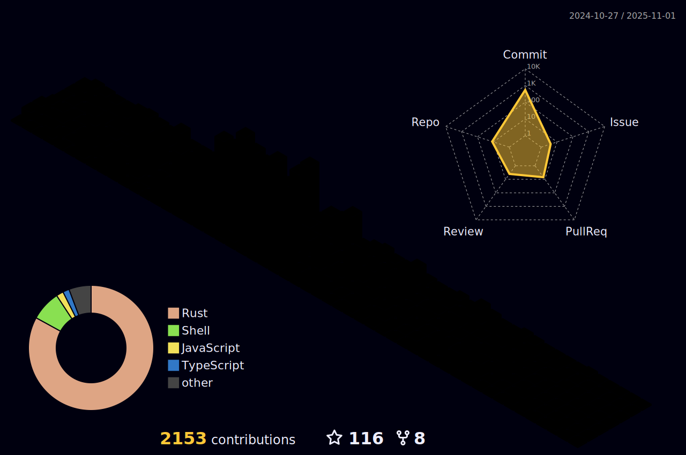

  

  
<h1 align="center">Hi 👋, I'm Linus Walker</h1>

<h3 align="center">A Full Stack Web dev, Machine Learning Engineer and Embedded dev from Burma</h3>

  

- 🔭 I’m currently working on [Chaos](https://github.com/Walker-00/chaos)

- 🌱 I’m currently learning **Rust, Surrealdb, Web3, Avr-hal, Actix, Tensorflow-binding for Rust**

- 🤝 I’m looking for help with [Chaos](https://github.com/Walker-00/chaos)

- 👯 My Best Friend Is RizeKishimaro (Ms.Black)

- 💬 Ask me about **Rust, Python, C, AI, ML, Embedded system, Web3, Web2, Cs**

- 📫 How to reach me **w000alker@gmail.com**

- ⚡ Fun fact **I'm a virgin.**

<h3 align="left">Connect with me:</h3>

## Language Skills

## Other Skills

